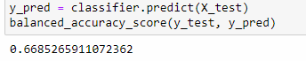
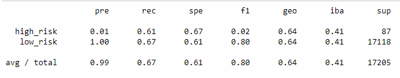
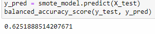
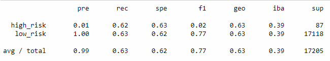
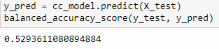
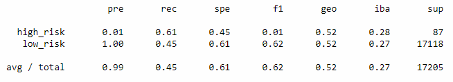
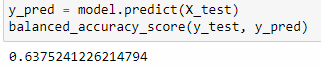
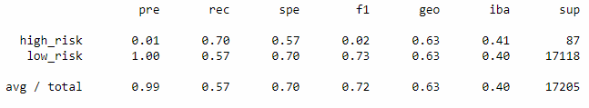
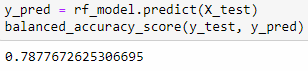
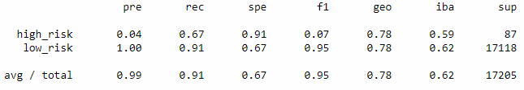

# Credit_Risk_Analysis

## Overview:
The purpose of this analysis is to attempt to utilize different supervised machine learning models and strategies to attempt to evaluate credit risk for the company LendingClub. 

## Results:
- RandomOverSampler:
	- Balanced Accuracy Score:
		- 
		- 66.9% is okay but could be better.
	- Imbalanced Classification Report:
		- 
		- An average precision of 0.99 is very good and overall shows the model is reliable and does not have many false positives. 
		- A recall of 0.67 shows this model has some issues resulting in many false negatives. Too many high risk investments falsely being predicted as low risk could be very dangerous for the lender. 
- SMOTE:
	- Balanced Accuracy Score:
		- 
		- 62.5% is still not great.
	- Imbalanced Classification Report:
		- 
		- An average precision of 0.99 is very good and overall shows the model is reliable and does not have many false positives.
		- A recall of 0.63 shows this model has some issues resulting in many false negatives. Too many high risk investments falsely being predicted as low risk could be very dangerous for the lender. 
- ClusterCentroids:
	- Balanced Accuracy Score:
		- 
		- 52.9% is not good.
	- Imbalanced Classification Report:
		- 
		- An average precision of 0.99 is very good and overall shows the model is reliable and does not have many false positives.
		- A recall of 0.45 shows this model has much worse issues resulting false negatives. Too many high risk investments falsely being predicted as low risk could be very dangerous for the lender. 
- SMOTEENN:
	- Balanced Accuracy Score:
		- 
		- 63.8% is once again, not suitable.
	- Imbalanced Classification Report:
		- 
		- An average precision of 0.99 is very good and overall shows the model is reliable and does not have many false positives.
		- A recall of 0.57 shows this model has issues resulting in many false negatives. Once again, too many high risk investments falsely being predicted as low risk could be very dangerous for the lender. 
- Balanced Random Forest:
	- Balanced Accuracy Score:
		- 
		- 78.8% is quite good. At first glance, this could be suitable for use.
	- Imbalanced Classification Report:
		- 
		- An average precision of 0.99 is very good and overall shows the model is reliable and does not have many false positives.
		- A recall of 0.91 is also quite good and shows a improvement over previous models at not having as many false negatives.
- Easy Ensemble Classifier:
	- Balanced Accuracy Score:
		- 
		- 92.5% is really good. Of all the models, this is most suitable to use according to this score.
	- Imbalanced Classification Report:
		- 
		- An average precision of 0.99 is very good and overall shows the model is reliable and does not have many false positives.
		- A recall of 0.94 is also very good and shows a substantial improvement over previous models at not having as many false negatives.

## Summary:
Overall, these models were better at predicting low risk rather than high risk loans, with various success at predicting high risk loans. 
EasyEnsembleClassifier is the easiest to recommend over the others as it had the highest balanced accuracy score, precision and recall, which were the three main metrics used to evaluate this analysis.

